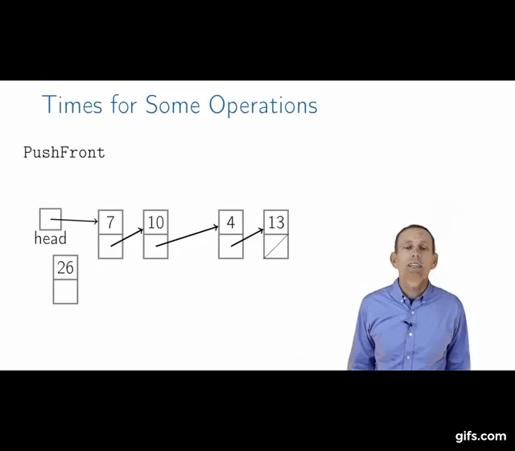

# Singly-Linked Lists
## Singly-Linked List

## Node contains:
   + head pointer
   + key (the values are assigned inside)
   + next pointer

## List API
| List API|                |
|:---:|:---:|
|PushFront(key)|add to front|
|key TopFront()|return front item|
|PopFront()|remove front item|
|PushBack(key)|add to back, also known as Append|
|key TopBack()|return back item|
|PopBack()|remove back item|
|Boolean Find(key)|is key in list?|
|Erase(key)|remove key from list|
|Boolean Empty()|empty list?|
|AddBefore(Node,key)|add key before node|
|AddAfter(Node,key)|add key after node|

### PushFront

   1. create a new node contained a key 
   2. the pointer of the new node points to the next node
   3. the head pointer points to the new node
   
### PopFront

   1. the head pointer pointer to the new front node
   2. remove the old front node
