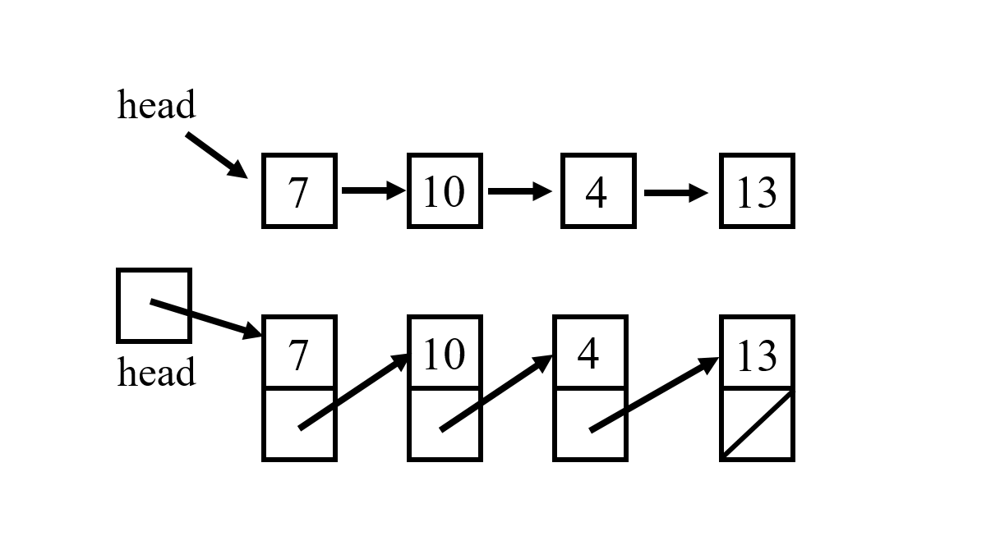
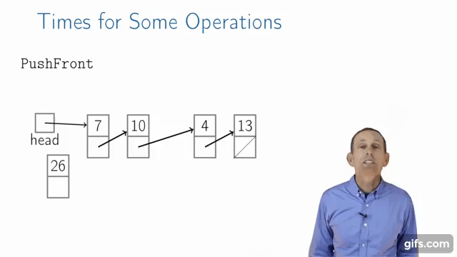
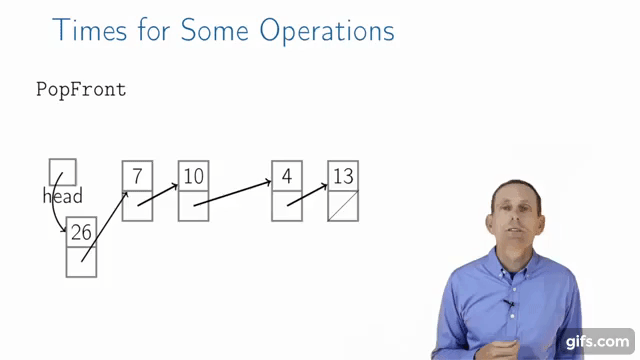
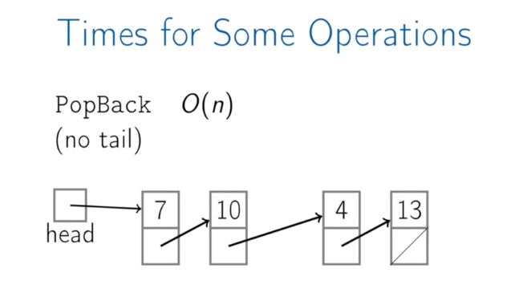
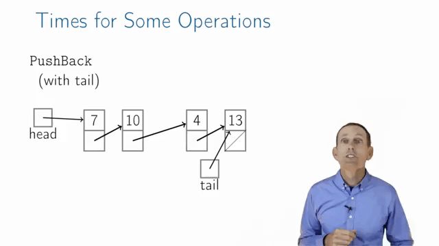

# Singly-Linked Lists
## Singly-Linked List

## Node contains:
   + head pointer
   + key (the values are assigned inside)
   + next pointer

## List API
| List API|                |
|:---:|:---:|
|PushFront(key)|add to front|
|key TopFront()|return front item|
|PopFront()|remove front item|
|PushBack(key)|add to back, also known as Append|
|key TopBack()|return back item|
|PopBack()|remove back item|
|Boolean Find(key)|is key in list?|
|Erase(key)|remove key from list|
|Boolean Empty()|empty list?|
|AddBefore(Node,key)|add key before node|
|AddAfter(Node,key)|add key after node|

### PushFront

   1. create a new node contained a key 
   2. the pointer of the new node points to the next node
   3. the head pointer points to the new node
   
### PopFront

   1. the head pointer pointer to the new front node
   2. remove the old front node
   
### PushBack(no tail)

.png)

   1. we don't have a tail pointer
   2. in order to find the last node, we start pointing **from the head pointer** to the last one
   3. create a new node
   4. the last node points to the new node
   5. insert null into the address of the new node
   
### PopBack(no tail)

   1. we don't have a tail pointer
   2. in order to find the last node, we start pointing **from the head pointer** to the last one
   3. remove the last node
   4. insert null into the address of the new last node
   
### PushBack(with tail)

   1. find the tail pointer 
   2. create a new node 
   3. the pointer of the last node points to the new node
   4. the tail pointer points to the new last node 
   5. insert null into the address of the new last node
   
### PopBack(with tail)

.gif)

   1. in order to remove the last node, we have to find out the new last node
   2. but we **dont have the pointer from the last node to the second-last node**
   3. so we start pointing from the head and walk down to the second-last one
   4. update the trail poiter to point the second-last node and remove the old last node
   5. insert null into the new last node

### Notice
   + if head pointer is "Null", it represents it is an empty list
   + if head pointer is equal to tail pointer, it represent there is only an one element in list
