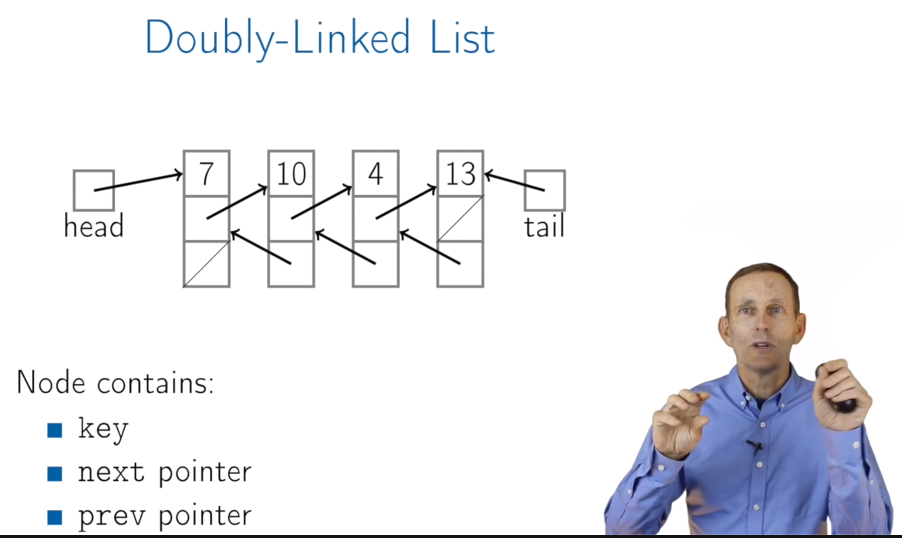
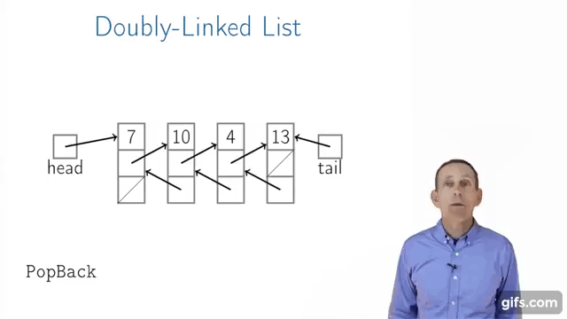
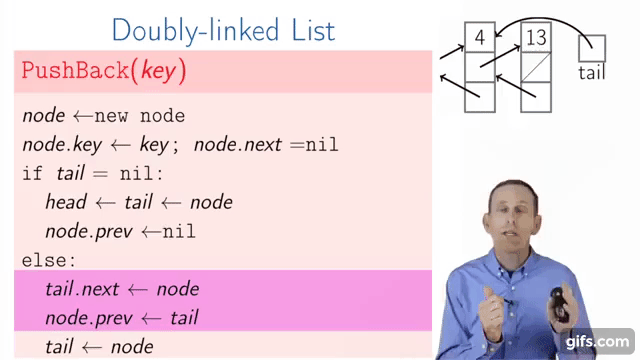
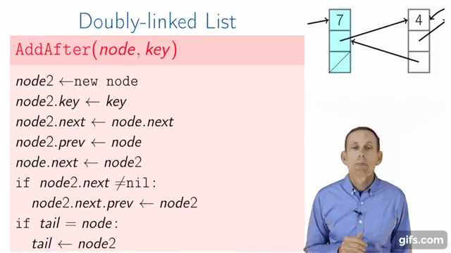

# Doubly-Linked Lists

## PopBack(with tail)

## PushBack(with tail)

## AddAfter(with tail)

## AddBefore(with tail)

### Time Complexity

|Doubly-linked list|no tail|with tail|
|:---:|:---:|:---:|
|PushFront(key)|O(1)||
|TopFront()|O(1)||
|PopFront()|O(1)||
|PushBack(key)|O(n)|O(1)|
|TopBack()|O(n)|O(1)|
|PopBack()|~~O(n)~~ O(1)||
|Find(key)|O(n)||
|Erase(key)|O(n)||
|Empty()|O(1)||
|AddBefore(node,key)|~~O(n)~~ O(1)||
|AddAfter(node,key)|O(1)||

## Summary

   + Constant time to insert at or remove from the front
   + With tail and doubly-linked, constant time to insert at or remove from the back
   + O(n) time to find arbitrary element
   + List elements need not be contiguous (every node has different memory address)
   + With doubly-linked list, constant time to insert between nodes or remove a node
   
## Different between array and linked list

   + we can go to anywhere we want in array but in linked list(the cost too expensive)
   + it is easy to add or remove an element but it's complicated in array
