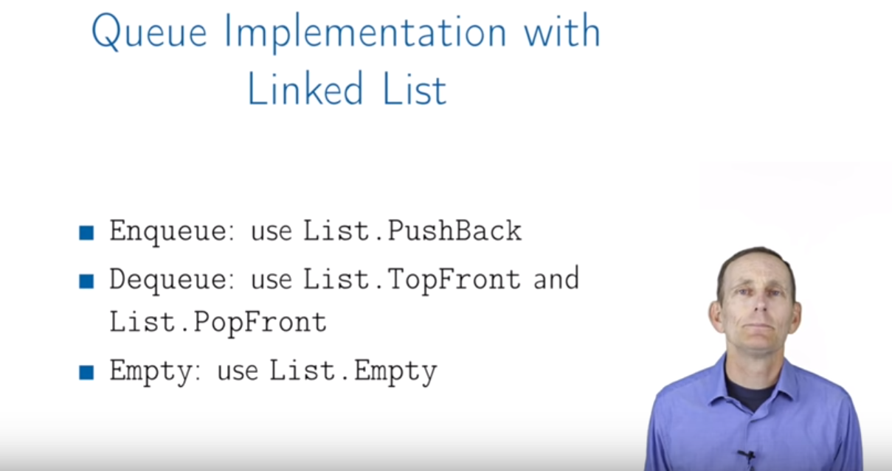

# Lecture: Queues

## Definition

Queues: **Abtract data type(ADT)** with the following operations:
   + Enqueue(key): adds key to collection
   + key Dequeue(): removes and returns least recently-added key
   + Boolean Empty(): are there any elements?
   + FIFO ( First in, first out)
   
## Queue implement in linked list

## Queue implement in array

   

## Summary
   + Queues can be implemented with either a linked list(with tail pointer) or an array
   + Each queue operation is O(1): Enqueue, Dequeue, Empty
   + the drawback of using an array is the limitation of size
   + the drawback of using a linked list is the another cost of memeory for pointer
