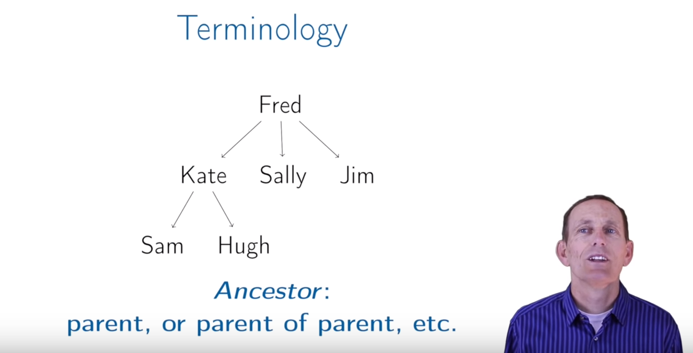
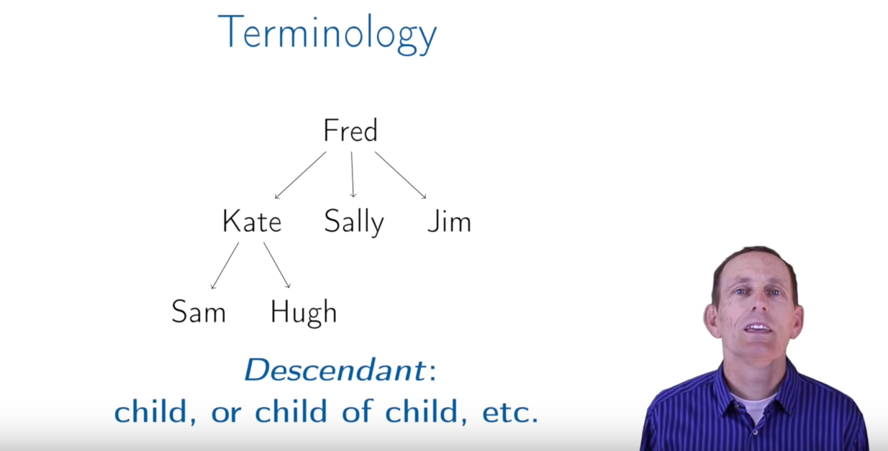
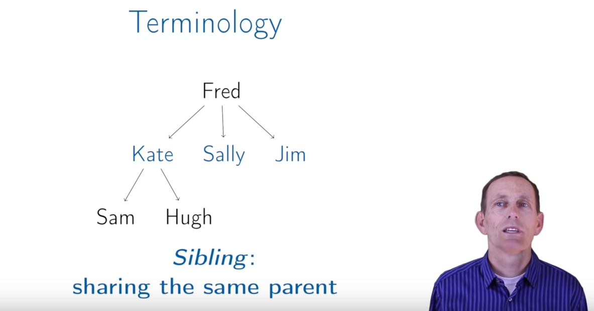
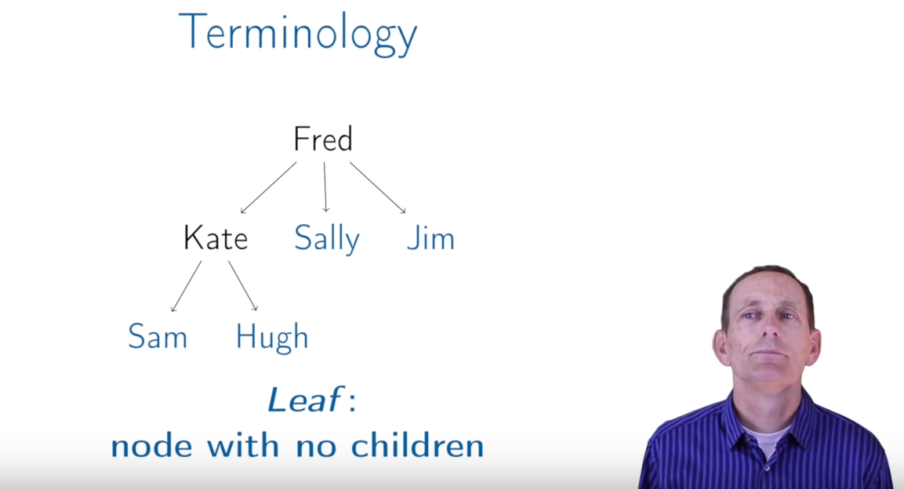
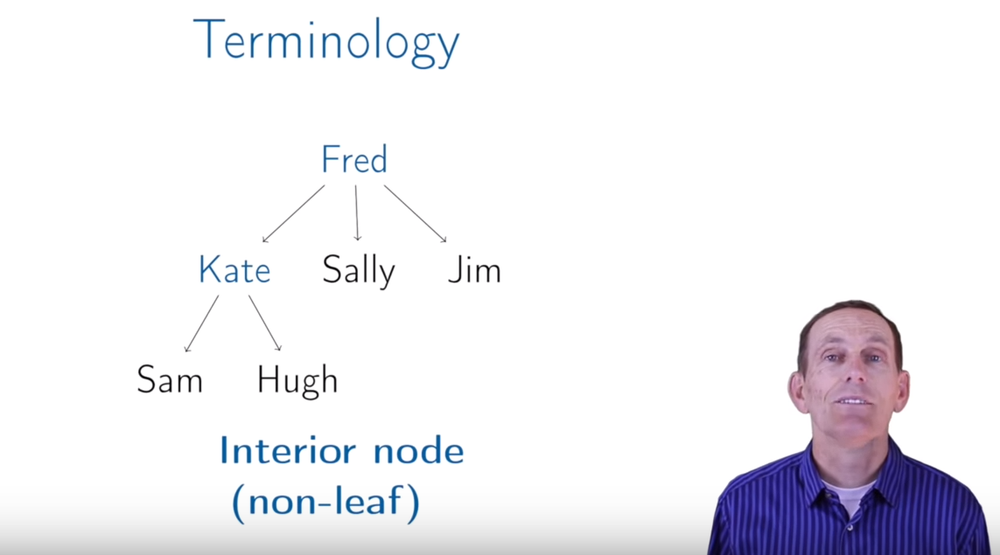
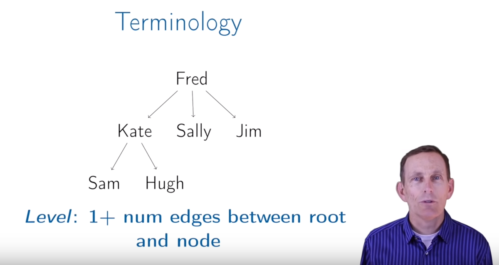
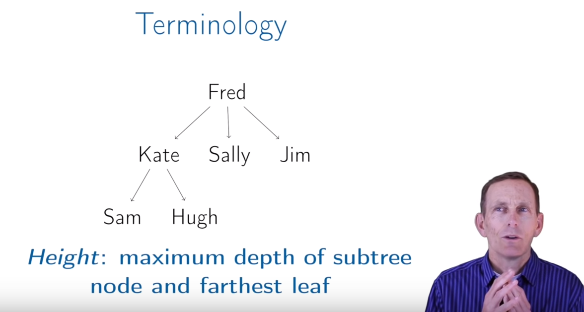
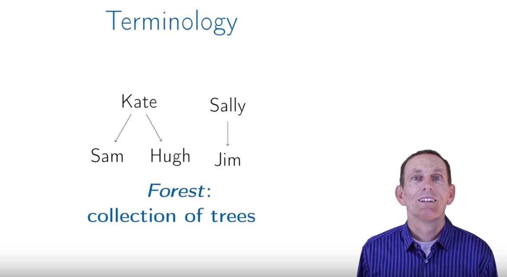

# Lecture: Trees
## Definition
A **tree** is:
   + empty, or
   + a node with:
      + a key, and
      + a list of child trees
      

   + Les is a node and has a key, Les
   + Les has two child trees, Cathy and Sam
   + Les is greater than Cathy and less than Sam in the first letter
   
   

## Terminology
### Root

### Child

   + Kate is a parent of Sam
   + Sam is a child of Kate
### Ancester

   
   + ancester of Sam is Kate and Fred
   
### Descendent

   + descendent of Fred are Kate, Sally, Jim, Sam, Huge

### Sibling

   + Kate, Sally, Jim are sibling
   + Sam, Huge are sibling
   
### Leaf

   + Sally, Jim, Sam, Huge are leaf
   
### Interior node(non-leaf)

   + Fred, Kate are interior node
   
### Level

   + Fred is level 1
   + Sally, Jim, Kate are level 2
   + Sam, Huge are level 3
   
### Height

   + Sam, Huge, Sally, Jim are height 1
   + Kate is height 2
   + Fred is height 3
   
### Forest

### Node contains:

   + key
   + children: list of children node
   + (optional) parent
   
### For binary tree: node contains:

   + key
   + left
   + right
   + (optional) parent
