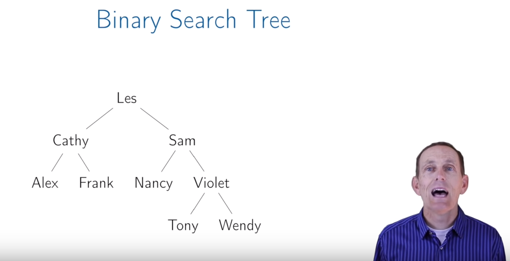
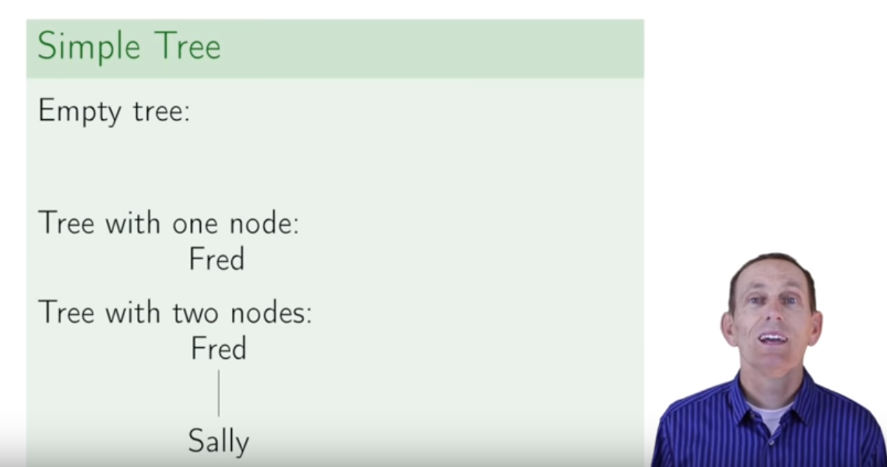
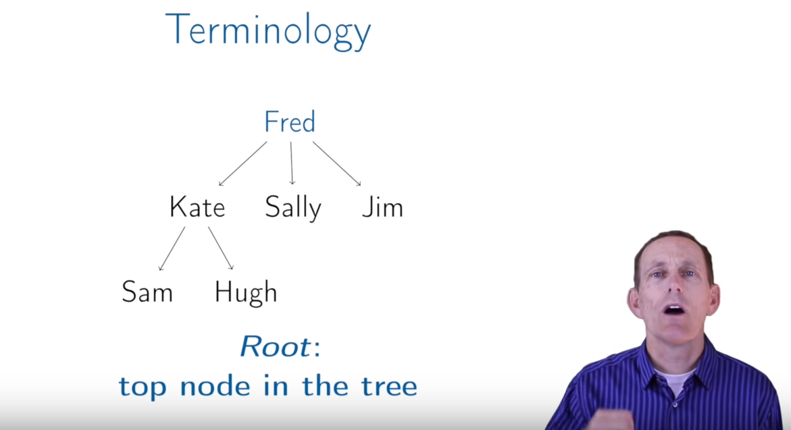
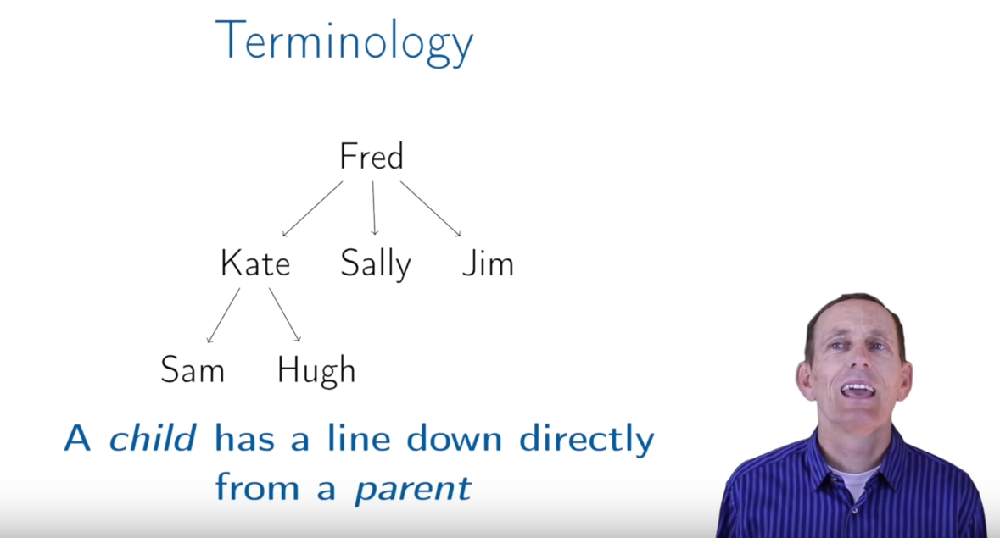

# Lecture: Trees
## Definition
A **tree** is:
   + empty, or
   + a node with:
      + a key, and
      + a list of child trees
      

   + Les is a node and has a key, Les
   + Les has two child trees, Cathy and Sam
   + Les is greater than Cathy and less than Sam in the first letter
   
   

## Root

## Child

   + Kate is a parent of Sam
   + Sam is a child of Kate
